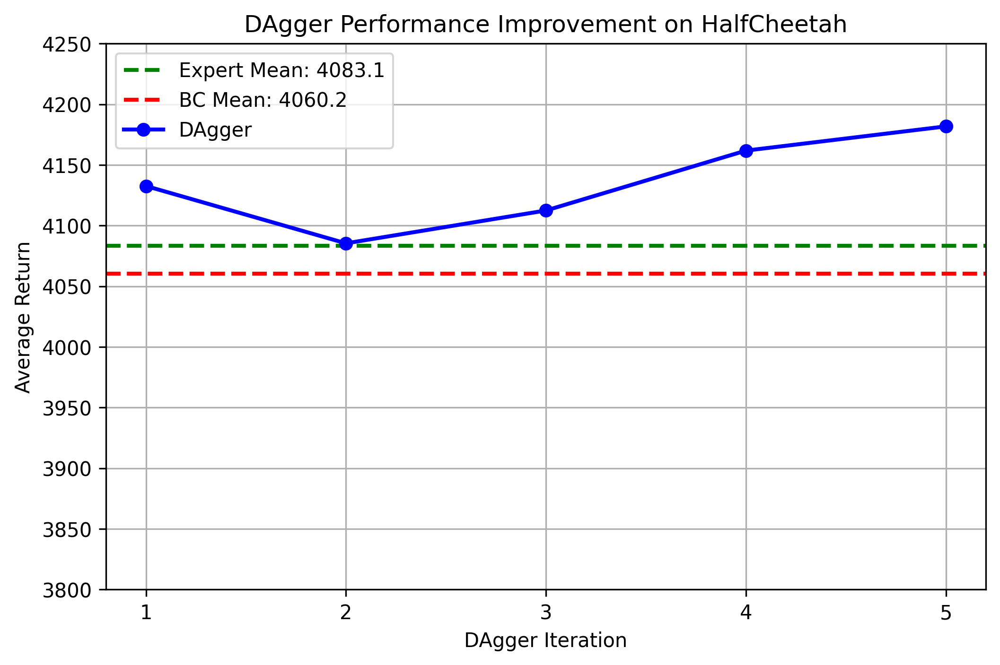

# Imitation Learning with Behavior Cloning and DAgger

A PyTorch implementation of **Behavior Cloning (BC)** and **DAgger (Dataset Aggregation)** for imitation learning in continuous control environments using Gymnasium and MuJoCo.

This project explores how iterative expert relabeling through DAgger improves policy robustness and mitigates compounding errors commonly observed in vanilla Behavior Cloning.

---

# Overview

Imitation learning aims to learn policies directly from expert demonstrations without relying on reward engineering or extensive online exploration.

This repository implements:

- Behavior Cloning (Supervised Imitation Learning)
- DAgger (Dataset Aggregation)
- Stochastic policy learning
- Rollout visualization and performance analysis

Environment used:
- `HalfCheetah-v4`

---

# Algorithms

## Behavior Cloning

Behavior Cloning treats imitation learning as a supervised learning problem.

The policy learns to map states to expert actions:

\[
\pi_\theta(a|s)
\]

using expert trajectory datasets.

However, BC often suffers from:
- covariate shift
- compounding errors
- poor recovery from unseen states

---

## DAgger

DAgger improves upon BC by iteratively:
1. Rolling out the learned policy
2. Collecting visited states
3. Querying expert actions for those states
4. Aggregating the new data into the training set
5. Retraining the policy

This significantly improves long-horizon policy robustness.

---

# Results

## DAgger Iterative Policy Improvement

The plot below shows the improvement of DAgger policies across iterations compared to:
- vanilla Behavior Cloning
- expert performance

<p align="center">
  
</p>

---

# Key Observations

- Vanilla Behavior Cloning achieved strong initial performance but suffered from distribution shift during long rollouts.
- DAgger improved policy robustness by iteratively collecting states visited by the learned policy and relabeling them using expert actions.
- DAgger policies consistently outperformed the BC baseline and approached expert-level performance.

---

# Rollout Videos

## Behavior Cloning Policy

<p align="center">
  
</p>

---

## DAgger Policy

<p align="center">
  
</p>

---

# Project Structure

```bash
.
├── train.py
├── eval.py
├── main.py
├── policy.py
├── loaded_gaussian_policy.py
├── dagger_training_curve.png
├── videos_bc_HalfCheetah/
├── videos_dagger_HalfCheetah/
└── README.md
```

---

# Training Pipeline

## 1. Expert Demonstration Collection

Expert trajectories are loaded from:

```bash
expert_data_HalfCheetah-v2.pkl
```

The dataset contains:
- observations
- expert actions
- rollout trajectories

---

## 2. Behavior Cloning Training

The BC policy is trained using supervised learning with MSE loss:

\[
\mathcal{L} = ||a_{expert} - a_{predicted}||^2
\]

---

## 3. DAgger Iterations

For each DAgger iteration:
- the current policy performs rollouts
- visited states are collected
- the expert labels corrective actions
- the dataset is aggregated
- the policy is retrained

Intermediate checkpoints are saved after every iteration.

---


# Technologies Used

- Python
- PyTorch
- Gymnasium
- MuJoCo
- NumPy
- Matplotlib

